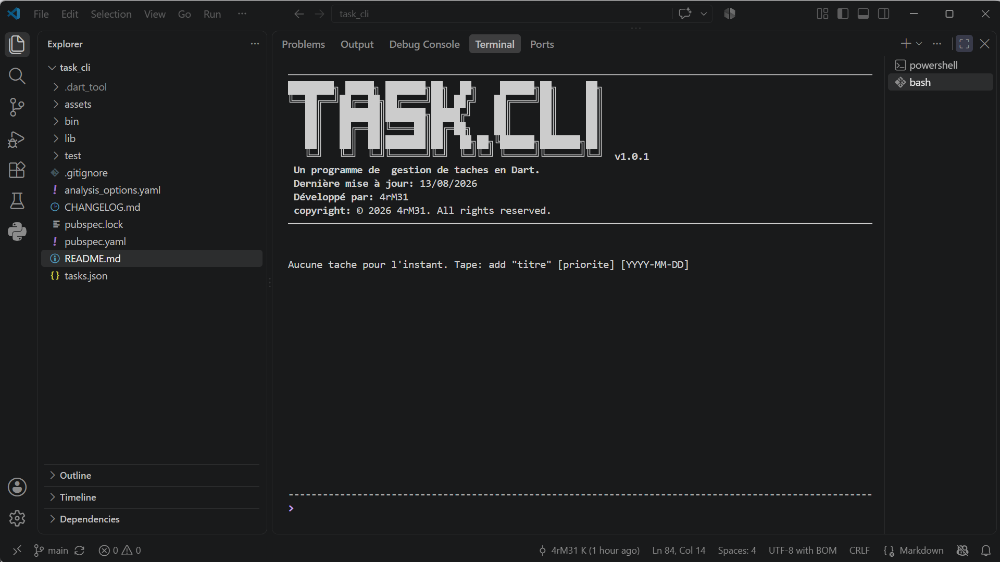

# Task.CLI

Task.CLI est une application en ligne de commande ecrite en Dart pour gerer une liste de taches locale. Elle permet d'ajouter, lister, trier, terminer et supprimer des taches tout en conservant les donnees dans un fichier JSON.

## Captures d'écran



## Fonctionnalites

- Ajouter une tache avec un titre, une priorite (`low`, `medium`, `high`) et une date limite optionnelle.
- Lister toutes les taches.
- Trier les taches par priorite ou par date limite.
- Marquer une tache comme terminee.
- Supprimer une tache.
- Persister les donnees dans un fichier JSON local (`tasks.json`).

## Architecture

Le projet suit une organisation par couches pour separer la logique metier, la persistance et l'interface terminale.

```text
Task.CLI/
├── bin/
│   └── task_cli.dart
├── lib/
│   ├── data/
│   │   ├── models/
│   │   └── repositories/
│   ├── domaine/
│   │   ├── entities/
│   │   ├── exceptions/
│   │   ├── repositories/
│   │   └── usecases/
│   ├── presentation/
│   │   ├── app/
│   │   ├── commands/
│   │   ├── screens/
│   │   └── widgets/
│   └── task_cli.dart
├── test/
│    └── ...
└── README.md
```

## Choix techniques

- `Task` est une classe abstraite.
- `StandardTask` et `UrgentTask` heritent de `Task` et portent des comportements differents via `type` et `requiresImmediateAttention`.
- `Repository<T>` est une interface generique.
- `TaskRepository` specialise cette interface avec `Repository<Task>`.
- `InMemoryTaskRepository` et `JsonFileTaskRepository` implementent `TaskRepository`.
- Les erreurs metier utilisent des exceptions personnalisees: `InvalidTaskException`, `TaskNotFoundException` et `StorageException`.
- Les tests sont separes par unite: entites, cas d'usage, repositories et parser de commandes.
- Une pipeline GitHub Actions lance le formatage, l'analyse statique et les tests.

## Installation

```bash
dart pub get
```

## Lancer l'application

```bash
dart run
```

L'application stocke les taches dans un fichier `tasks.json` cree dans le dossier depuis lequel la commande est lancee. Ce fichier est ignore par Git pour eviter de versionner les donnees locales.

## Commandes disponibles

```text
add "titre" [low|medium|high] [YYYY-MM-DD]
list
list priority
list date
done <numero>
delete <numero>
update <numero> "nouveau titre" [low|medium|high] [YYYY-MM-DD]
priority <numero> <low|medium|high>
help
quit
```

Exemples:

```text
add "Preparer la demo" high 2026-08-20
add "Lire la documentation" low
list priority
list date
done 1
delete 2
```

## Lancer les tests

```bash
dart test
```

## Analyse statique

```bash
dart analyze
```

## Formatage

```bash
dart format .
```

## Pistes d'evolution

- Ajouter une commande pour modifier uniquement la date limite.
- Ajouter des filtres (`done`, `pending`, `overdue`).
- Ajouter une exportation CSV ou Markdown.
